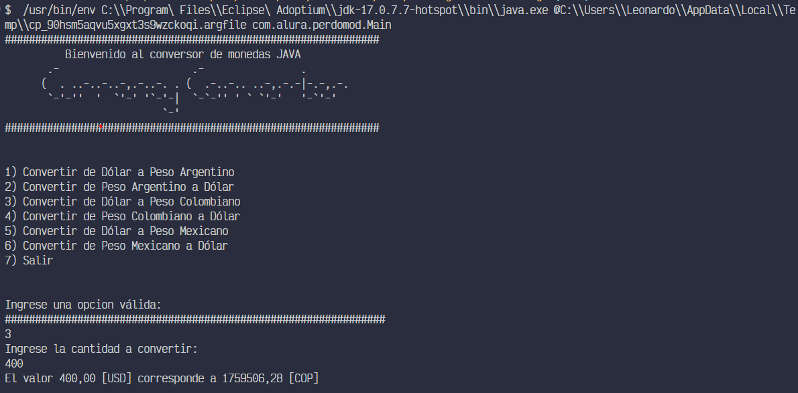

<h1 align="center">Desafio 1 Java - Alura Latam - Conversor de Mondedas</h1>

<div align="center">
   Solucion al desafio de desarrollo de un conversor de monedas con Java utlizando llamadas a la api externa de [ExchangeRate-API](https://www.exchangerate-api.com/). 
</div>


<!-- TABLE OF CONTENTS -->

## Contenido


- [Contenido](#contenido)
- [Descripción General](#descripción-general)
- [Construido Con](#construido-con)
- [Caracteristicas](#caracteristicas)
- [Como Usar](#como-usar)
- [Capturas de Pantalla](#capturas-de-pantalla)
  - [Desktop](#desktop)
- [Contacto](#contacto)


<!-- OVERVIEW -->

## Descripción General


El desafio consiste en desarrollar un conversor de monedas con Java utlizando llamadas a la api externa de [ExchangeRate-API](https://www.exchangerate-api.com/). La aplicacion debe permitir al usuario elegir una moneda de origen y una moneda de destino, ingresar un monto en la moneda de origen y mostrar el monto convertido en la moneda de destino. 

Experiencia: Durante el desarrollo de este desafio, aprendi a utilizar HttpClient para realizar llamadas a una API externa y a manejar las respuestas de la API. Tambien aprendi a utilizar la libreria Gson para convertir los objetos JSON en objetos Java. 

## Construido Con

- [Java](https://www.java.com/)
- [HttpClient](https://docs.oracle.com/en/java/javase/11/docs/api/java.net.http/java/net/http/HttpClient.html)
- [Gson](https://google.github.io/gson)
- [ExchangeRate-API](https://www.exchangerate-api.com/)
- [IntelliJ IDEA](https://www.jetbrains.com/idea/)
  
## Caracteristicas

- La aplicacion permite al usuario elegir una moneda de origen y una moneda de destino.
- La aplicacion permite al usuario ingresar un monto en la moneda de origen.
- La aplicacion muestra el monto convertido en la moneda de destino.
- La aplicacion muestra un mensaje de error si la moneda de origen o la moneda de destino no son validas.

Requisitos:

- Java 11
- IntelliJ IDEA
- ExchangeRate-API Key
- Gson
- HttpClient
- 

## Como Usar

Para clonar y correr esta aplicación, necesitarás [Git](https://git-scm.com) instalado en tu computadora. Desde tu terminal, corre:

```bash
# Clonar este repositorio
$ git clone https://github.com/leonardoapd/exchange-rate-challenge.git


# Ir al directorio del proyecto
$ cd exchange-rate-challenge

```

## Capturas de Pantalla

### Desktop


## Contacto

- Website [leonardo-perdomo](https://leonardo-perdomo.netlify.app/)
- GitHub [@leonardoapd](https://github.com/leonardoapd)
- Twitter [@leonardoapd](https://twitter.com/leonardoapd)